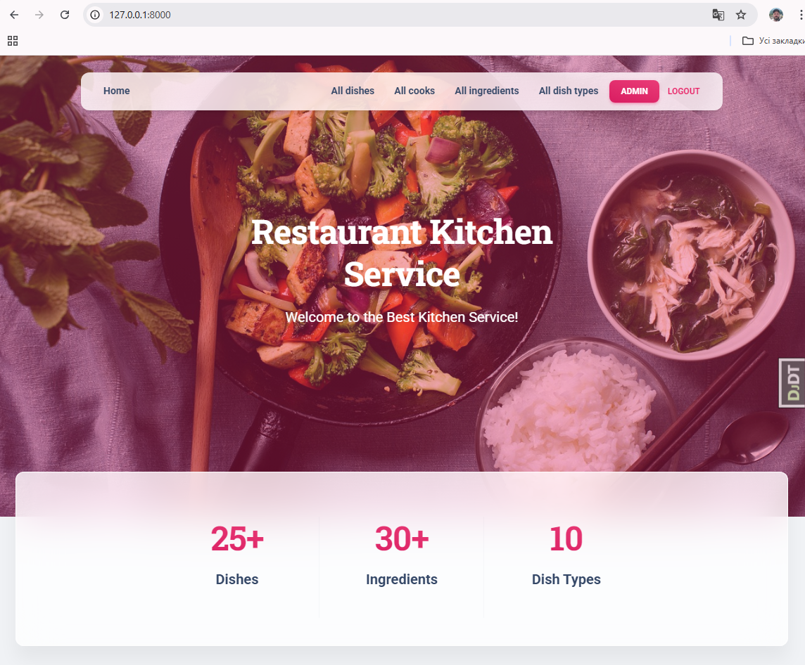
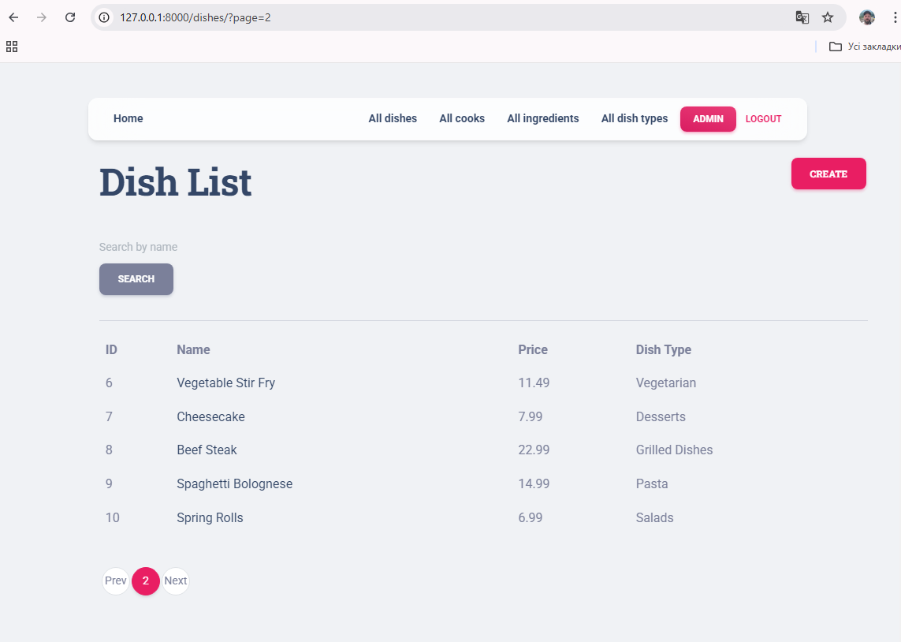
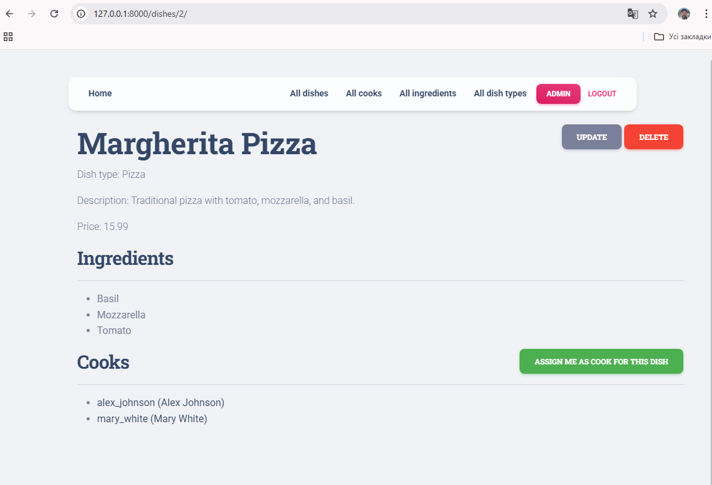

# Restaurant Kitchen Service

Restaurant Kitchen Service is a web application for kitchen management.
Cooks can search, create, edit, and delete dishes, dish types and ingredients.


## Check it out!

[Restaurant Kitchen Service project deployed to Render] ...


## Installing / Getting started


Clone the repository, navigate to the project directory,
create and activate a virtual environment, install the required dependencies:

```shell
git clone https://github.com/ruslanyemets/restaurant-kitchen-service
cd restaurant-kitchen-service
python3 -m venv venv
source venv/bin/activate  # For Linux/MacOS
venv\Scripts\activate  # For Windows
pip install -r requirements.txt
```

Set up environment variables by creating a .env file in the root directory with the following content:

```shell
SECRET_KEY=your_secret_key
DEBUG=True
```

Run database migrations, load data to database from JSON and start the development server:

```shell
python manage.py migrate
python manage.py loaddata restaurant_kitchen_service_db_data.json
python manage.py runserver
```

Open your browser and go to http://127.0.0.1:8000/ to see the app in action.


## Usage

Once the server is running, you can access the application through your browser.
Create superuser and use created username and password to log in.

```shell
python manage.py createsuperuser
```


## Running Tests

To run tests for the application, use the following command:

```shell
python manage.py test
```


## Features

* Authentication functionality for cooker/user
* Managing and searching dishes, cooks, dish types and ingredients directly from website interface
* Powerful admin panel for advanced managing


## Demo




